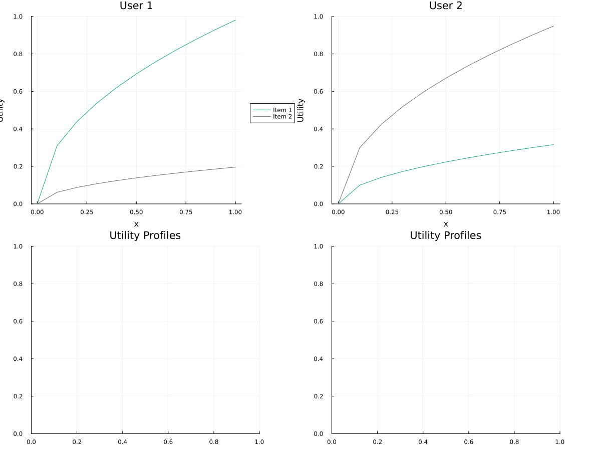

# Budget Allocation Mechanism Simulator

This repository contains a simulator for comparing budget allocation mechanisms. It simulates strategic users who modify their reported preferred allocations in an attempt to maximize their individual utility.

The most surprising result of the simulation is that, for a wide variety of preference profiles, an equilibrium is reached at a point close to optimal.

## Motivation

### Incentive Compatible Budget Allocation

The problem of allocation a limited budget among multiple competing projects (or public goods or policies or whatever) has been stymieing academics for decades. It first it looks like it should be simple: just ask everybody what they think the allocation should be, and take some sort of average. But when the pioneering social choice theorists  tried this, they ran into difficulties. Never mind that there are many different ways you can define the "average"; the big problem is that people will do whatever produces the best outcome for themselves. And no matter what aggregation function you use, self-interested people can get better results for themselves by proposing something *different from what they really want the allocation to be*. 

This may seem counter-intuitive. Normally when you vote, if you vote for the person you want to win, that person is more likely to win! So there is no incentive to lie. We say that majority voting (between two candidates) is [**strategyproof**](https://en.wikipedia.org/wiki/Strategyproofness), in that there is no voting strategy better than just voting for exactly what you want.

But budget allocation mechanisms are generally not strategyproof. For example, suppose you think 80% of the budget should go to your favorite project, but the average for the group was 40%; your favorite project is under-funded while other projects are over-funded. So you would be better off *saying* you think 100% should go to your favorite project and 0% to the others, thereby raising the final average of your favorite project and lowering the average for the others. 

If there are only two projects, there *is* a [strategyproof mechanism that uses the median](https://en.wikipedia.org/wiki/Median_voter_theorem) instead of the mean. But when there are more than three alternatives, things get ugly. In fact eventually [Allan Gibbard](https://en.wikipedia.org/wiki/Allan_Gibbard) proved that it [just wasn't possible](https://en.wikipedia.org/wiki/Gibbard%27s_theorem) to design a mechanism for choosing among more than two alternatives that was strategyproof and not severely limited in certain ways. 

### Alternatives

So what do we do? It doesn't seem acceptable that one person can impose their will on others by lying. Nevertheless, budgets must be allocated! So let's get realistic. What if *everybody lies*? Or at least we don't even pretend that people's proposed budget is their *preferred* budget. Rather we recognize it as a kind of game, where people make a proposal they think will produce the best results for themselves, given the current set of proposals and the mechanism for aggregating them. And then other people respond, trying to maximize their results given what everyone else is doing. Maybe things balance out?

Here is the point where we move from theory to experiment. The results of these simulations show that, yes, things kind of do balance out.

## Goals of the Simulation

Using a variety of profiles of user preferences, the simulation tells us if:

- if an equilibrium is reached
- how close the allocations are close to the overall [optimal](#defining-optimality)
- if results disproportionately benefit some individuals at the expense of others
- how incentive-aligned the mechanism is (how close individuals reports are to their "true optimal" allocations)

## Setup

`n` users need to allocate a budget across `m` items. Each user has a utility functions that returns their total utility given their allocation vector.

User submits their proposed allocation vectors and the mechanism outputs a final allocation with a total less than the budget.

Users then take turns updating their reports by best-responding: maximizing their own utility given the reports of other users.

The simulation terminates if no user is able to improve their utility more than some threshhold. 

## Results

The following is the output of the simulation for all combinations of mechanisms and preferences currently implemented. Since these are averages across preference profiles, the averages aren't really that useful for comparing mechanisms -- different mechanisms work better for certain types of preference profiles. 

But since I have implemented a variety of preference profiles, it is interesting to note how close to optimality many mechanisms are overall.

Another striking result is that most simulations reach an equilibrium for most preference profiles.

    ┌────────────────────────┬─────────────┬─────────────────┬─────────────────────┬───────────────┬────────────────────┐
    │ Mechanism              │ Mean Rounds │ Equilibrium (%) │ Mean Optimality (%) │ Mean Envy (%) │ Mean Alignment (%) │
    ├────────────────────────┼─────────────┼─────────────────┼─────────────────────┼───────────────┼────────────────────┤
    │ Mean                   │         4.0 │            90.0 │                95.7 │          15.6 │               60.5 │
    │ Median                 │         2.7 │            90.0 │                99.0 │          11.5 │               84.9 │
    │ PairwiseMeanTradeoff   │         3.0 │           100.0 │                89.0 │          20.0 │               67.8 │
    │ PairwiseMedianTradeoff │         4.8 │            90.0 │                89.9 │          21.4 │               73.6 │
    │ PairwiseProbability    │         1.6 │           100.0 │                87.6 │          19.3 │               96.1 │
    │ QuadraticFunding       │         3.9 │            90.0 │                89.8 │          20.6 │               56.0 │
    │ SAP                    │         1.6 │           100.0 │                93.3 │          27.0 │               88.3 │
    │ SAPScaled              │         5.7 │            50.0 │                86.5 │          33.3 │               77.1 │
    └────────────────────────┴─────────────┴─────────────────┴─────────────────────┴───────────────┴────────────────────┘
### Description of Output Columns 

- Equilibrium is the % of profiles for which equilibrium is reached
- Utility is the mean utility-per-user
- Optimality is the difference between this and the maximum possible normalized utility. Each user's utility function is normalized so their maximum utility = 1.0.
- Envy is the difference between the utility of the user who has the maximum utility in the final allocation and the user with the minimum
- Incentive Alignment is a mean Euclidian distance between users' "honest" reports and final reports.

## Defining Optimality

The mean optimality is calculated based on total utility (the sum of utilities for all users). But Kenneth Arrow famously argued that individual subjective utilities can't be added togeter: “it seems to make no sense to add the utility of one individual, a psychic magnitude in his mind, with the utility of another individual”.

So instead of considering user's subjective utility as an absolute quantity, we consider each user's utility as a percentage of their maximum possibility utility.

This is consistent with many intuitive notions of what is fair. For example, if each user gets 99% of their optimal utility, overall optimality is 99%. If we did not normalize utility, the optimal solution would be weighted towards users with higher absolute values of subjective utility.


### Output Files

The simulation outputs files organized by mechanism:

- `output/log/[mechanism_name]/[preference_name].txt`: Detailed log of the simulation

The simulation also generates preference visualization plots in:

- `output/plots/preferences/[preference_name].png`

## Limitations

This simulations aren't a substitute for a more formal equilibrium analysis. It assumes players behave in a certain way:

- Users always start by reporting their ideal point and only change their reports in response to other users.
- Users play in a fixed order and always play the current "best response", defined as the response that maximizes utility *given the other players' current responses*. This may not be how a rational user can maximizes expected utility in real life. Specifically, "best-responding" may be a *bad* move for some mechanisms. For example skipping a turn, and allowing the next user to best-respond, could produce better outcomes in some cases.
- There are no attempts by groups to collude.

So rational agent really trying to optimize their results might find other ways to manipulate the output.

On the other hand, the simulation does show that in most cases there seems to be a nash equilibrium where no user can profitably deviate.

# Development 

## Dependencies

- just
- julia

## Running Locally

Once Julia is installed, you can install all the needed packages by running:

    just instantiate

Then to run the simulation for all mechanisms, run

    just sim

To simulate a single mechanism or mechanisms, pass the mechanism file names:

    just sim mechanisms/SAP.jl

Likewise to simulate a single preference profile:

    just sim preferences/CondorcetCycle.jl


## Example

### Defining Mechanisms and Preferences

To implement a new mechanism or preference profile, add a .jl file under the `mechanisms/` or `preferences/` folders directory.

The mechanism is simply a function that inputs an allocation matrix and outputs a vector. 

A preference profile is 1) a function that outputs the utility for a given user allocation vector and 2) a set of optimal points. Helper function will create a square-root profile where $`Uᵢ = ∑ⱼb_{i,j}*x_{i,j}²`$ for some matrix of coefficients b. 

In this preference profile, user 1 strongly prefers item 1, and user 2 strongly prefers item 2.

#### Example Preferences: `preferences/HighConflictTwoUsers.jl`

```julia

# Diametrically opposite preferences between two users
return sqrt_preferences([
    5.0  1.0
    1.0  3.0
])

```

The simulation generates a plot of the preference profile in output/plots



#### Example Mechanism: `SAP.jl`

A mechanism is a function that takes an allocation matrix as an input and returns a single allocation vector. The final allocations will be capped by the simulator so that the sum is <= 1.0. 

```julia

# Select at Percentile (SAP) mechanism based on Steve Vitka's SAPTool
# For each column:
# 1. Sort values in ascending order
# 2. Select highest row where sum ≤ 1.0
# 3. Return those values (may not sum to 1.0)
function SAP(reports)
    n, m = size(reports)
    sorted_votes = hcat([sort(reports[:, j]) for j in 1:m]...)
    row_sums = sum.(eachrow(sorted_votes))
    sp = findlast(≤(1.0), row_sums)
    
    return isnothing(sp) ? zeros(m) : sorted_votes[sp, :]
end

return SAP


```

#### Run the Simulation

    ❯ just sim mechanisms/SAP.jl preferences/HighConflictTwoUsers.jl
    time julia --project Main.jl mechanisms/SAP.jl preferences/HighConflictTwoUsers.jl
    Loading preferences /Users/jwarden/Dropbox/social-protocols/mecsim/preferences/HighConflictTwoUsers.jl
    optimalPoints =
    2×2 Matrix{Float64}:
     0.961538  0.0384615
     0.1       0.9
    overall_optimal_point = [0.5620173672946042, 0.43798263270539584]
    [Running] Pref=HighConflictTwoUsers | Mech=SAP | Round=2 | Alloc=0.10,0.90,... | Optimality=86.5 | Align=46.6 ✅

    Preference: HighConflictTwoUsers

    Optimal Points and Utilities:
    ┌──────┬────────────────────┬─────────────────┐
    │ User │ Optimal Allocation │ Optimal Utility │
    ├──────┼────────────────────┼─────────────────┤
    │    1 │   [0.962, 0.038]   │             1.0 │
    │    2 │     [0.1, 0.9]     │             1.0 │
    │  ALL │   [0.562, 0.438]   │           0.865 │
    └──────┴────────────────────┴─────────────────┘


    Mechanism Outcomes for HighConflictTwoUsers:
    ┌───────────┬────────┬────┬─────────────────────────┬───────────┬──────┬───────┬────────┐
    │ Mechanism │ Rounds │ Eq │ Reports                 │ Alloc     │ Opt% │ Envy% │ Align% │
    ├───────────┼────────┼────┼─────────────────────────┼───────────┼──────┼───────┼────────┤
    │ SAP       │      2 │ ✓  │ [0.03,0.57];[0.10,0.90] │ 0.10,0.90 │ 86.5 │  50.4 │   46.6 │
    └───────────┴────────┴────┴─────────────────────────┴───────────┴──────┴───────┴────────┘


    ================================================================================
    OVERALL SUMMARY ACROSS ALL PREFERENCES
    ================================================================================
    ┌───────────┬─────────────┬─────────────────┬─────────────────────┬───────────────┬────────────────────┐
    │ Mechanism │ Mean Rounds │ Equilibrium (%) │ Mean Optimality (%) │ Mean Envy (%) │ Mean Alignment (%) │
    ├───────────┼─────────────┼─────────────────┼─────────────────────┼───────────────┼────────────────────┤
    │ SAP       │         2.0 │           100.0 │                86.5 │          50.4 │               46.6 │
    └───────────┴─────────────┴─────────────────┴─────────────────────┴───────────────┴────────────────────┘


#### Simulation Output

And a detailed log of the simulation is output to: output/logs/SAP/HighConflictTwoUsers.txt

In this case, user 2 modifies their proposed allocation to best-respond to user 1, and an equilibrium is immediately reached.


    Optional points: [0.9615384615384615 0.038461538461538436; 0.1 0.9]
    Starting allocation: [0.1, 0.038461538461538436]

    === Round 1 ===
    Current report matrix:
    2×2 Matrix{Float64}:
     0.961538  0.0384615
     0.1       0.9
    User 1's turn.
      Best response = [0.03396559495192303, 0.5661207932692303]
      => User 1 improves by switching to best response
      => User 1's new report: [0.03396559495192303, 0.5661207932692303]
      Old utility = 0.34854837493455965
      New utility = 0.49613893835683387
      Honest utility = 0.34854837493455965
      Incentive Alignment = 0.46642345628490733
      Allocation after user 1: [0.1, 0.9]
    User 2's turn.
      => No improvement found; user 2 stays with old report.
      Old utility = 1.0
      New utility = 0.9999969722338864
      Honest utility = 1.0
      Incentive Alignment = 0.46642345628490733
      Allocation after user 2: [0.1, 0.9]

    === Round 2 ===
    Current report matrix:
    2×2 Matrix{Float64}:
     0.0339656  0.566121
     0.1        0.9
    User 1's turn.
      => No improvement found; user 1 stays with old report.
      Old utility = 0.49613893835683387
      New utility = 0.49613893835683387
      Honest utility = 0.34854837493455965
      Incentive Alignment = 0.46642345628490733
      Allocation after user 1: [0.1, 0.9]
    User 2's turn.
      => No improvement found; user 2 stays with old report.
      Old utility = 1.0
      New utility = 0.9999969722338864
      Honest utility = 1.0
      Incentive Alignment = 0.46642345628490733
      Allocation after user 2: [0.1, 0.9]
    Converged! Maximum improvement in utility < 0.0001.
    Final reports:
    2×2 Matrix{Float64}:
     0.0339656  0.566121
     0.1        0.9
    Final Allocation: [0.1, 0.9]
    Overall Utility: 1.4961389383568338
