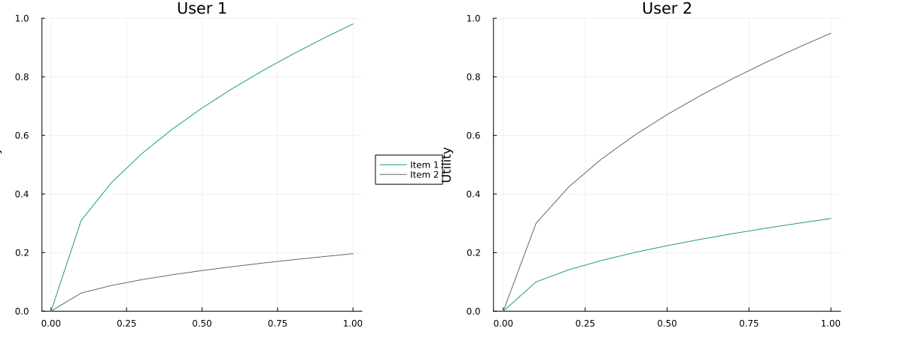

# Participatory Budget Aggregation Mechanism Simulator

This repository contains a simulator for comparing budget aggregation mechanisms. It simulates an iterative process where each user proposes an aggregation vector, and then strategically modify their proposals in response to other users' proposals in an attempt to maximize their individual utility.

Interestingly, for a wide variety of preference profiles and mechanisms, users arrive at an equilibrium that is close to the overall-utility-maximizing allocation -- even though users final proposals different significantly from their individual optimal allocations.

## Motivation

### Incentive Compatible Budget Allocation

The problem of allocation a limited budget among multiple competing projects (or public goods or policies or whatever) has been studied for over a century. It first it looks like it should be simple: just ask everybody what they think the allocation should be, and take some sort of average. But when the pioneering social choice theorists tried this, they ran into difficulties. Setting aside the different ways you can define "average", the big problem is that people will do whatever produces the best outcome for themselves. And no matter what aggregation function you use, self-interested people can get better results for themselves by proposing something *different from what they really want the allocation to be*. 

This may seem counter-intuitive. In a simple majority vote between two alternatives, if you vote for the alternative you prefer, that alternative is more likely to be chosen! So there is no incentive to lie. We say that majority voting (between two alternatives) is [**strategyproof**](https://en.wikipedia.org/wiki/Strategyproofness), in that there is no voting strategy better than just voting for what you want.
 
But budget allocation mechanisms are generally not strategyproof. For example, suppose you think 80% of the budget should go to your favorite project, but the average vote for the group is 40%. If the final mechanism is a simple mean, then your favorite project will be under-funded (while other projects are over-funded). So you would be better off *saying* you think 100% should go to your favorite project and 0% to the others, raising the mean for your favorite project and bringing the results closer to your ideal.

Now if there are only two projects, there *is* a [strategyproof mechanism that uses the median](https://en.wikipedia.org/wiki/Median_voter_theorem) instead of the mean. But when there are more than three alternatives, things get complicated. In fact eventually [Allan Gibbard](https://en.wikipedia.org/wiki/Allan_Gibbard) proved that it [just wasn't possible](https://en.wikipedia.org/wiki/Gibbard%27s_theorem) to design a strategyproof mechanism for choosing among more than two alternatives that was not either dictatorial, or that limited what kind of preferences users could have.

### Alternatives

So what do we do? It doesn't seem acceptable that one person can impose their will on others by lying. Nevertheless, budgets must be allocated! So let's get realistic. What if *everybody lies*? Or at least we don't even pretend that people's proposed budget is their *preferred* budget. Rather we acknowledge it as a negotiation, where people make a proposal they think will produce the best results for themselves, given the current set of proposals of other users. And then other people respond, trying to maximize their results given what everyone else is doing. Maybe things balance out?

Here is the point where we move from theory to experiment. These simulations show that, yes, things actually do balance out pretty nicely!

## Goals of the Simulation

Using a variety of profiles of user preferences, and a variety of different aggregation formulas (mechanisms), the simulation tells us if:

- if an equilibrium is reached
- how close the final allocation is to the overall [optimal](#defining-optimality)
- if results disproportionately benefit some individuals at the expense of others
- how incentive-aligned the mechanism is (how close individuals reports are to their "true optimal" allocations)

## Setup

- `n` users need to allocate a budget across `m` items. 
- The budget is capped at 1.0. 
- Each user has a utility functions that returns their total utility given their allocation vector.
- User submits their proposed allocation vectors and the mechanism outputs a final allocation. 
- If the final allocation is greater than the budget of 1.0, then the allocation vector is scaled down so that the sum equals 1.0.
- Users then take turns updating their reports by attempting to best-respond: to maximizing their own utility given the reports of other users. The best response is found using Nelder-Mead.
- The simulation terminates if no user is able to improve their utility more than some threshold, or when a maximum number of rounds is reached.

## Summary of Results

The following is a summary of the results of the simulation, showing the mean results for each mechanism across a variety of preference profiles.

The results don't necessarily show us which mechanism is "best", because results depends so much on what users actual preference profiles are. But it is interesting to note how close to optimal many of these mechanisms are for a variety of preference profiles -- even when users have widely conflicting preferences.

    ┌──────────────────────────┬─────────────┬─────────────────┬─────────────────────┬────────────┬───────────────┬────────────────────┐
    │ Mechanism                │ Mean Rounds │ Equilibrium (%) │ Mean Optimality (%) │ vs. Honest │ Mean Envy (%) │ Mean Alignment (%) │
    ├──────────────────────────┼─────────────┼─────────────────┼─────────────────────┼────────────┼───────────────┼────────────────────┤
    │ CoordinatewiseMean       │         4.4 │           100.0 │                89.7 │       -2.9 │          21.1 │               65.3 │
    │ CoordinatewiseMeanScaled │         4.3 │            96.6 │                94.6 │       +1.6 │          17.8 │               71.2 │
    │ CoordinatewiseMedian     │         2.5 │           100.0 │                98.3 │       +2.9 │          24.3 │               89.2 │
    │ IndependentMarkets       │         1.6 │           100.0 │                83.5 │       +0.0 │          23.9 │               98.1 │
    │ Knapsack                 │         3.7 │            96.6 │                95.0 │       +7.7 │          25.4 │               76.0 │
    │ PairwiseMeanTradeoff     │         3.9 │           100.0 │                94.5 │       +5.6 │          15.5 │               67.6 │
    │ PairwiseMedianTradeoff   │         5.3 │            93.1 │                95.9 │       +5.7 │          20.5 │               77.4 │
    │ PairwiseProbability      │         1.7 │           100.0 │                82.3 │       +8.5 │          21.8 │               96.0 │
    │ PairwiseProbability2     │         1.2 │           100.0 │                80.5 │       -0.0 │          14.6 │               97.3 │
    │ PairwiseProbability3     │         1.7 │           100.0 │                87.3 │       -0.6 │          16.5 │               95.0 │
    │ PiecewiseUniformPhantom  │         1.4 │           100.0 │                83.9 │       +0.0 │          23.7 │               98.3 │
    │ QuadraticFunding         │         4.7 │            96.6 │                88.4 │       +2.5 │          24.3 │               64.8 │
    │ QuadraticVariant         │         4.7 │            93.1 │                92.4 │       +7.1 │          12.4 │               75.4 │
    │ SAP                      │         2.1 │           100.0 │                94.4 │       +6.7 │          30.5 │               90.3 │
    │ SAPScaled                │         8.5 │            51.7 │                83.6 │       -1.6 │          45.4 │               76.6 │
    │ UniformPhantom           │         2.1 │           100.0 │                83.3 │       +0.4 │          22.7 │               93.8 │
    └──────────────────────────┴─────────────┴─────────────────┴─────────────────────┴────────────┴───────────────┴────────────────────┘

### Description of Output Columns 

- Equilibrium is the % of profiles for which equilibrium is reached
- Optimality is the difference between this and the maximum possible normalized utility. Each voter's utility function is normalized so their maximum utility = 1.0
- "vs. Honest" is the difference in utility of the equilibrium allocation and the allocation that would result if all users reported honestly. A positive number means that strategic reporting has had a net positive effect on social welfare. 
- Envy is the difference between the utility of the voter who has the maximum utility in the final allocation and the voter with the minimum
- Incentive Alignment is a mean Euclidian distance between voters' "honest" reports and final reports.

## Defining Optimality

The mean optimality is calculated based on total utility (the sum of utilities for all voters). But Kenneth Arrow famously argued that individual subjective utilities can't be added together: “it seems to make no sense to add the utility of one individual, a psychic magnitude in his mind, with the utility of another individual”.

So instead of considering voter's subjective utility as an absolute quantity, we consider each voter's utility as a percentage of their maximum possibility utility.

This is consistent with many intuitive notions of what is fair. For example, if each voter gets 99% of their optimal utility, overall optimality is 99%. If we did not normalize utility, the optimal solution would be weighted towards voters with higher absolute values of subjective utility.

## Results Across Preference Profiles

I've implemented three different domains of preference profiles, with a variety of concrete profiles under each. Plots of the preference profiles can be found in .

### Quasilinear Square Root Preference Profiles

Quasilinear (Square root) profiles have the form $`Vᵢ(y) = 1 - ∑ⱼy_j + ∑ⱼ b_{i,j}√y_j`$. These are the same as square root preference except that unused budget has utility (equal to the amount of unused budget). Users will prefer to use up all the budget as long as there are projects where marginal return is greater than 1.0.

This is appropriate for budget allocation settings where there are diminishing marginal utility for the competing projects, and where the money doesn't come from nowhere. This would be appropriate for equity situations (DAOs, corporations, HOAs, etc.), where unused budget is retained in the corporation and shared by equity holders.

### Square Root Preference Profiles

Square root profiles have the form $`Vᵢ(y) = ∑ⱼ b_{i,j}√y_j`$. These are concave and monotonically increasing, which is appropriate for budget allocation settings where there are diminishing marginal utility for the competing projects, but marginal utility never turns negative. This means voters always prefer to "use up" the whole budget, and this 

### Quadratic Preference Profiles

Quadratic profiles have the form $`Vᵢ(y) = ∑ⱼ 2b_{i,j}y_j - y_j^2`$. These are concave and single-peaked, which may be appropriate for budget allocation settings where marginal utilities eventually turn negative -- there can be "too much of a good thing" for some items. In these settings, voters may not always prefer to use up the whole budget (depending on where the peak is).


### ℓ1 Preference Profiles

These have the form $`Vᵢ(y) = 1 - l1_norm(y, b\_j)`$. That is, utility is 1 minus the disutility of the l1 distance between users preferred allocation and the actual allocation. These are included because certain mechanisms in the literature have been shown to be strategyproof under this domain of preferences.

================================================================================
SUMMARY BY PREFERENCE CLASS
================================================================================
┌──────────────────────────┬──────────────────┬─────────────┬─────────────────┬─────────────────────┬────────────┬───────────────┬────────────────────┐
│ Mechanism                │ Preference Class │ Mean Rounds │ Equilibrium (%) │ Mean Optimality (%) │ vs. Honest │ Mean Envy (%) │ Mean Alignment (%) │
├──────────────────────────┼──────────────────┼─────────────┼─────────────────┼─────────────────────┼────────────┼───────────────┼────────────────────┤
│ CoordinatewiseMean       │ Quadratic        │         6.0 │           100.0 │                88.0 │       -9.3 │          27.0 │               56.4 │
│ CoordinatewiseMean       │ QuasilinearSqrt  │         4.8 │           100.0 │                99.2 │       -0.6 │           6.0 │               70.6 │
│ CoordinatewiseMean       │ Sqrt             │         3.2 │           100.0 │                98.8 │       -1.0 │           8.5 │               70.5 │
│ CoordinatewiseMean       │ l1               │         3.9 │           100.0 │                75.2 │       -2.8 │          41.2 │               61.5 │
│ CoordinatewiseMeanScaled │ Quadratic        │         5.2 │           100.0 │                98.8 │       -0.2 │           8.7 │               63.2 │
│ CoordinatewiseMeanScaled │ QuasilinearSqrt  │         3.6 │           100.0 │                99.6 │       -0.2 │           5.2 │               72.8 │
│ CoordinatewiseMeanScaled │ Sqrt             │         2.7 │           100.0 │                98.6 │       -1.2 │           9.2 │               75.4 │
│ CoordinatewiseMeanScaled │ l1               │         5.6 │            88.9 │                84.5 │       +6.4 │          41.1 │               71.2 │
│ CoordinatewiseMedian     │ Quadratic        │         3.2 │           100.0 │                94.5 │       +3.5 │           9.5 │               76.5 │
│ CoordinatewiseMedian     │ QuasilinearSqrt  │         2.3 │           100.0 │                98.6 │       +3.2 │           8.4 │               89.0 │
│ CoordinatewiseMedian     │ Sqrt             │         2.7 │           100.0 │                98.4 │       +6.6 │          16.5 │               89.3 │
│ CoordinatewiseMedian     │ l1               │         2.2 │           100.0 │                99.9 │       -0.0 │          53.7 │               96.2 │
│ IndependentMarkets       │ Quadratic        │         1.0 │           100.0 │                75.3 │       +0.0 │          36.4 │              100.0 │
│ IndependentMarkets       │ QuasilinearSqrt  │         2.8 │           100.0 │                88.5 │       -0.0 │           9.9 │               94.3 │
│ IndependentMarkets       │ Sqrt             │         1.3 │           100.0 │                98.8 │       +0.0 │           8.5 │               99.5 │
│ IndependentMarkets       │ l1               │         1.0 │           100.0 │                72.8 │       +0.0 │          41.2 │              100.0 │
│ Knapsack                 │ Quadratic        │         4.2 │           100.0 │                85.1 │       +5.1 │           7.6 │               74.5 │
│ Knapsack                 │ QuasilinearSqrt  │         3.1 │           100.0 │                97.0 │      +12.5 │           6.8 │               73.4 │
│ Knapsack                 │ Sqrt             │         4.0 │           100.0 │                96.3 │      +12.7 │          23.5 │               75.7 │
│ Knapsack                 │ l1               │         3.7 │            88.9 │                97.5 │       +1.0 │          55.1 │               79.8 │
│ PairwiseMeanTradeoff     │ Quadratic        │         4.0 │           100.0 │                98.9 │       +0.1 │           8.2 │               62.2 │
│ PairwiseMeanTradeoff     │ QuasilinearSqrt  │         2.8 │           100.0 │                99.5 │       +0.4 │           4.0 │               69.9 │
│ PairwiseMeanTradeoff     │ Sqrt             │         2.8 │           100.0 │                98.2 │       +0.5 │           8.2 │               75.1 │
│ PairwiseMeanTradeoff     │ l1               │         5.7 │           100.0 │                84.6 │      +17.4 │          35.9 │               63.5 │
│ PairwiseMedianTradeoff   │ Quadratic        │         3.4 │           100.0 │                98.7 │       -0.0 │           7.7 │               74.2 │
│ PairwiseMedianTradeoff   │ QuasilinearSqrt  │         3.9 │           100.0 │                99.7 │       +0.6 │           5.6 │               78.0 │
│ PairwiseMedianTradeoff   │ Sqrt             │         6.7 │            83.3 │                99.5 │       +1.4 │          10.8 │               80.2 │
│ PairwiseMedianTradeoff   │ l1               │         6.9 │            88.9 │                88.1 │      +16.9 │          49.1 │               76.7 │
│ PairwiseProbability      │ Quadratic        │         1.8 │           100.0 │                74.6 │      +55.8 │          36.1 │               91.9 │
│ PairwiseProbability      │ QuasilinearSqrt  │         1.7 │           100.0 │                88.2 │       +0.1 │           9.0 │               97.4 │
│ PairwiseProbability      │ Sqrt             │         1.7 │           100.0 │                98.2 │       -1.4 │           7.0 │               97.7 │
│ PairwiseProbability      │ l1               │         1.8 │           100.0 │                70.1 │       -2.9 │          36.7 │               95.7 │
│ PairwiseProbability2     │ Quadratic        │         1.2 │           100.0 │                97.4 │       -0.1 │           8.4 │               94.7 │
│ PairwiseProbability2     │ QuasilinearSqrt  │         1.3 │           100.0 │                97.3 │       +0.2 │           3.3 │               94.9 │
│ PairwiseProbability2     │ Sqrt             │         1.0 │           100.0 │                92.1 │       +0.0 │           7.6 │              100.0 │
│ PairwiseProbability2     │ l1               │         1.1 │           100.0 │                46.6 │       -0.2 │          33.9 │               99.1 │
│ PairwiseProbability3     │ Quadratic        │         2.2 │           100.0 │                98.6 │       +1.8 │           9.9 │               90.2 │
│ PairwiseProbability3     │ QuasilinearSqrt  │         1.7 │           100.0 │                98.9 │       -0.0 │           4.1 │               94.4 │
│ PairwiseProbability3     │ Sqrt             │         1.3 │           100.0 │                96.3 │       -0.7 │           8.3 │               97.9 │
│ PairwiseProbability3     │ l1               │         1.8 │           100.0 │                63.4 │       -2.4 │          38.1 │               96.5 │
│ PiecewiseUniformPhantom  │ Quadratic        │         1.0 │           100.0 │                75.3 │       +0.0 │          36.4 │              100.0 │
│ PiecewiseUniformPhantom  │ QuasilinearSqrt  │         1.9 │           100.0 │                88.7 │       +0.1 │           9.9 │               95.9 │
│ PiecewiseUniformPhantom  │ Sqrt             │         1.7 │           100.0 │                98.9 │       -0.0 │           8.0 │               98.0 │
│ PiecewiseUniformPhantom  │ l1               │         1.0 │           100.0 │                73.9 │       +0.0 │          40.9 │              100.0 │
│ QuadraticFunding         │ Quadratic        │         5.8 │            80.0 │                75.5 │       +2.6 │          36.7 │               51.8 │
│ QuadraticFunding         │ QuasilinearSqrt  │         4.4 │           100.0 │                99.1 │       +5.8 │           7.4 │               70.7 │
│ QuadraticFunding         │ Sqrt             │         3.7 │           100.0 │                99.4 │       -0.6 │           8.7 │               66.0 │
│ QuadraticFunding         │ l1               │         5.1 │           100.0 │                77.4 │       +1.2 │          44.9 │               65.2 │
│ QuadraticVariant         │ Quadratic        │         4.4 │           100.0 │                96.7 │      +20.4 │           6.6 │               64.9 │
│ QuadraticVariant         │ QuasilinearSqrt  │         3.6 │           100.0 │                92.8 │       +4.2 │           7.8 │               73.9 │
│ QuadraticVariant         │ Sqrt             │         1.0 │           100.0 │                91.9 │       +0.0 │           4.9 │              100.0 │
│ QuadraticVariant         │ l1               │         8.3 │            77.8 │                90.0 │       +7.3 │          25.3 │               66.5 │
│ SAP                      │ Quadratic        │         2.2 │           100.0 │                81.6 │       +6.9 │          27.0 │               88.3 │
│ SAP                      │ QuasilinearSqrt  │         2.4 │           100.0 │                96.6 │       +3.6 │          10.4 │               89.5 │
│ SAP                      │ Sqrt             │         1.7 │           100.0 │                95.1 │      +14.5 │          26.9 │               83.3 │
│ SAP                      │ l1               │         1.9 │           100.0 │                98.7 │       +4.5 │          55.0 │               96.8 │
│ SAPScaled                │ Quadratic        │         9.8 │            40.0 │                69.8 │       -3.2 │          49.7 │               71.8 │
│ SAPScaled                │ QuasilinearSqrt  │         8.9 │            44.4 │                85.2 │       -2.5 │          21.7 │               70.6 │
│ SAPScaled                │ Sqrt             │         7.7 │            66.7 │                95.6 │       -2.9 │          25.9 │               81.8 │
│ SAPScaled                │ l1               │         7.9 │            55.6 │                81.5 │       +1.1 │          79.8 │               81.7 │
│ UniformPhantom           │ Quadratic        │         2.2 │           100.0 │                75.5 │       +0.3 │          36.4 │               90.6 │
│ UniformPhantom           │ QuasilinearSqrt  │         1.9 │           100.0 │                88.5 │       +0.0 │          10.0 │               94.9 │
│ UniformPhantom           │ Sqrt             │         2.2 │           100.0 │                98.8 │       +0.1 │           8.3 │               95.9 │
│ UniformPhantom           │ l1               │         2.1 │           100.0 │                72.1 │       +0.9 │          37.4 │               93.1 │
└──────────────────────────┴──────────────────┴─────────────┴─────────────────┴─────────────────────┴────────────┴───────────────┴────────────────────┘

### Detailed Simulation Logs

Summary results for each preference profile are available [here](https://github.com/johnwarden/mecsim/blob/master/output/summary.txt)

Detailed simulation logs for each mechanism/preference combination are available [here](https://github.com/johnwarden/mecsim/blob/master/output/log)

## Limitations and Caveats

- The simulation uses Julia's Optim.jl with Nelder-Mead, which is pretty good but it might sometimes find a local optimum and not discover the voter's absolute best response.
- This simulations aren't a substitute for a more formal equilibrium analysis. It assumes players behave in a certain way:
    - Voters always start by reporting their ideal point and only change their reports in response to other voters.
    - Voters play in a fixed order and always play the current "best response", defined as the response that maximizes utility *given the other players' current responses*. This may not be how a rational voter can maximizes expected utility in real life. Specifically, "best-responding" may be a *bad* move for some mechanisms. For example skipping a turn, and allowing the next voter to best-respond, could produce better outcomes in some cases.
    - There are no attempts by groups to collude.

- So rational agent really trying to optimize their results might find other ways to manipulate the output. 
- On the other hand, the simulation does show that in most cases there seems to be a nash equilibrium where no voter can profitably deviate.


## Example

### Defining Mechanisms and Preferences

To implement a new mechanism or preference profile, add a .jl file under the `mechanisms/` or `preferences/` folders directory.

A mechanism is a function that takes an allocation matrix as an input and returns a single allocation vector. The final allocations will be capped by the simulator so that the sum is <= 1.0. 

A preference profile is defined by 1) utility for a given voter allocation vector and 2) a set of optimal points. Helper function will create a square-root profile or quadratic profile for some matrix of coefficients b. 

#### Example Preferences: `preferences/HighConflictTwoVoters.jl`

In this preference profile, voter 1 strongly prefers item 1 over item 2, and voter 2 strongly prefers item 2 over item1.

```julia

# Diametrically opposite preferences between two voters
return sqrt_preferences([
    5.0  1.0
    1.0  3.0
])

```

The simulation generates a plot of the preference profile in output/plots



#### Example Mechanism: `SAP.jl`


```julia

# Select at Percentile (SAP) mechanism based on Steve Vitka's SAPTool
# For each column:
# 1. Sort values in ascending order
# 2. Select highest row where sum ≤ 1.0
# 3. Return those values (may not sum to 1.0)
function SAP(reports)
    n, m = size(reports)
    sorted_votes = sort(reports, dims=1)
    row_sums = sum.(eachrow(sorted_votes))
    sp = findlast(≤(1.0), row_sums)
    
    return isnothing(sp) ? zeros(m) : sorted_votes[sp, :]
end

return SAP


```

#### Run the Simulation

    ❯ just sim mechanisms/SAP.jl preferences/sqrt/HighConflictTwoVoters.jl
    time julia --project Main.jl mechanisms/SAP.jl preferences/sqrt/HighConflictTwoVoters.jl
    Loading preferences /Users/jwarden/Dropbox/social-protocols/mecsim/preferences/sqrt/HighConflictTwoVoters.jl
    optimalPoints =
    2×2 Matrix{Float64}:
     0.961538  0.0384615
     0.1       0.9
    overall_optimal_point = [0.5620173672946042, 0.43798263270539584]
    [Running] Pref=HighConflictTwoVoters | Mech=SAP | Round=2 | Alloc=0.10,0.90,... | Optimality=86.5 | Align=46.6 ✅

    Preference Profile: HighConflictTwoVoters

    Optimal Points and Utilities:
    ┌──────┬────────────────────┬─────────────────┐
    │ User │ Optimal Allocation │ Optimal Utility │
    ├──────┼────────────────────┼─────────────────┤
    │    1 │   [0.962, 0.038]   │             1.0 │
    │    2 │     [0.1, 0.9]     │             1.0 │
    │  ALL │   [0.562, 0.438]   │           0.865 │
    └──────┴────────────────────┴─────────────────┘


    Mechanism Outcomes for HighConflictTwoVoters:
    ┌───────────┬────────┬────┬─────────────────────────┬───────────┬──────┬───────┬────────┐
    │ Mechanism │ Rounds │ Eq │ Reports                 │ Alloc     │ Opt% │ Envy% │ Align% │
    ├───────────┼────────┼────┼─────────────────────────┼───────────┼──────┼───────┼────────┤
    │ SAP       │      2 │ ✓  │ [0.03,0.57];[0.10,0.90] │ 0.10,0.90 │ 86.5 │  50.4 │   46.6 │
    └───────────┴────────┴────┴─────────────────────────┴───────────┴──────┴───────┴────────┘


    ================================================================================
    OVERALL SUMMARY ACROSS ALL PREFERENCES
    ================================================================================
    ┌───────────┬─────────────┬─────────────────┬─────────────────────┬───────────────┬────────────────────┐
    │ Mechanism │ Mean Rounds │ Equilibrium (%) │ Mean Optimality (%) │ Mean Envy (%) │ Mean Alignment (%) │
    ├───────────┼─────────────┼─────────────────┼─────────────────────┼───────────────┼────────────────────┤
    │ SAP       │         2.0 │           100.0 │                86.5 │          50.4 │               46.6 │
    └───────────┴─────────────┴─────────────────┴─────────────────────┴───────────────┴────────────────────┘


#### Simulation Output

And a detailed log of the simulation is output to: output/log/SAP/sqrt/HighConflictTwoVoters.txt

In this case, voter 1 modifies their proposed allocation to best-respond to voter 2. After this, the voters are already in equilibrium -- neither voter can improve their utility by changing their vote.

    Optimal points: [0.9615384615384615 0.038461538461538436; 0.1 0.9]
    Starting allocation: [0.1, 0.038461538461538436]

    === Round 1 ===
    Current report matrix:
    2×2 Matrix{Float64}:
     0.961538  0.0384615
     0.1       0.9
    Current allocation: [0.1, 0.038461538461538436]
    Voter 1's turn.
      Best response = [0.03396559495192303, 0.5661207932692303]
      New allocation: [0.1, 0.9]
      => Voter 1 improves by switching to best response
      Old utility = 0.34854837493455965
      New utility = 0.49613893835683387
      Honest utility = 0.34854837493455965
      Incentive Alignment = 0.46642345628490733
    Voter 2's turn.
      => No improvement found; voter 2 stays with old report.
      Old utility = 1.0
      New utility = 0.9999969722338864
      Honest utility = 1.0
      Incentive Alignment = 0.46642345628490733

    === Round 2 ===
    Current report matrix:
    2×2 Matrix{Float64}:
     0.0339656  0.566121
     0.1        0.9
    Current allocation: [0.1, 0.9]
    Voter 1's turn.
      => No improvement found; voter 1 stays with old report.
      Old utility = 0.49613893835683387
      New utility = 0.49613893835683387
      Honest utility = 0.34854837493455965
      Incentive Alignment = 0.46642345628490733
    Voter 2's turn.
      => No improvement found; voter 2 stays with old report.
      Old utility = 1.0
      New utility = 0.9999969722338864
      Honest utility = 1.0
      Incentive Alignment = 0.46642345628490733
    Converged! Maximum improvement in utility < 0.0001.
    Final reports:
    2×2 Matrix{Float64}:
     0.0339656  0.566121
     0.1        0.9
    Final Allocation: [0.1, 0.9]
    Mean Utility: 0.7480694691784169
    Optimality: 0.7480694691784169
    Envy: 50.386106164316615
    Incentive Alignment: 0.46642345628490733


# Development 

## Dependencies

- just
- julia

## Running Locally

Once Julia is installed, you can install all the needed packages by running:

    just instantiate

Then to run the simulation for all mechanisms, run

    just sim

To simulate a single mechanism or mechanisms, pass the mechanism file names:

    just sim mechanisms/SAP.jl

Likewise to simulate a single preference profile:

    just sim preferences/CondorcetCycle.jl

## Output Files

- Summary tables: `output/log/summary.txt`
- Detailed log files organized by mechanism: `output/log/[mechanism_name]/[preference_name].txt`
- Preference visualization plots: `output/plots/preferences/[preference_name].png`

